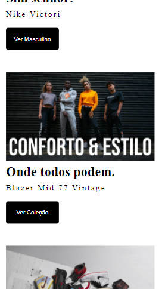

<<<<<<< HEAD
# landing-page-template
=======
# landing Page Template

<h3>Alterações e idéias feitas no Conteúdo principal(main) do elemento</h3>

Olá a todos, Me chamo Arthur Kelvim e sou o desenvolvedor responsável por trás das alterações feitas no conteúdo principal do nosso projeto. Aqui irei prestar algumas informações sobre como planejei e alguns detalhes importantes do projeto.

Antes de mais nada, algumas informações técnicas sobre o projeto, estarão abaixo:

Status do Projeto: Ativo/Funcionando 

Acesso ao Projeto: foamy-kittens.surge.sh 

Tecnologias Utilizadas: HTML e CSS

Pessoas Desenvolvedoras: Arthur Kelvim(Desenvolvedor Front-End), Barbara Zaú(Desenvolvedora Front-END) e Déborah Luna

Conclusao: Recebemos uma tarefa onde tinhamos de concluir um site de uma Empresa de Tênis. O projeto foi algo simples onde usamos conteúdos que aprendemos em nossas aulas no curso na Labenu, sem deixar o lado desafiador. Construímos uma estrutura simples, mas bem feita. Precisavamos sermos técnicos e também críticos, pois o projeto exigia ter um conteúdo responsivo e focado em "Mobile First". Acredito sim que concluímos o objetivo com êxito. 

<h4>O Projeto</h4>

A princípio tinhamos de construir um site de uma empresa de calçados, onde o site fosse responsivo e que fosse focado no conceito "Mobile First". Então fomos aos trabalhos.

Como fiquei responsável pela parte do conteúdo principal(main), coube a mim projetar como ficaria esta parte do site. Mas claro sempre com idéias dos outros amigos desenvolvedores(Barbara ♥ e Deborah ♥). E vamos ao código, sem mais delongas.

Quando estavámos pensando em como deveria ficar a parte do layout logo pensamos, "Algo simples, mas formoso aos olhos", então pensamos em cores nada muito chamativas, abaixo está a paleta de cores usada neste projeto: >

#2e3237 - Cinza Escuro

#dae5e8 - Azul claro

E então seguimos. Como pensamos em nada muito chamativo nas cores do site, por que não um site um tanto minimalista sem tanta poluição visual? "Great Idea!", afinal, tinhamos que por trás de tudo deixarmos nosso conteúdo também "confortavél aos olhos" para que tudo não virasse algo tão poluído aos olhos dos nossos queridos usuários. Foi ai que decidimos não colocar muita informação e partirmos pro lado mais "Faça pouco, mas faça bonito", Já ouviu essa frase? não? nem eu, acabei de inventar rsrs, brincadeiras a parte. E foi dai que partirmos para a criação da estrutura principal do nosso site.

Decidimos colocar um texto importantissímo no inicio da nossa tag >main<, o Sobre da nossa loja.

Um texto longo, porém bem construído e bem pensado. Onde fala bastante sobre a empresa. Usamos um belo background na cor: #dae5e8 - Azul claro, e justificamos o texto.

Continuando o projeto, tinhamos de mostrar os produtos em seguida. Acreditamos que fizemos também mais um belo trabalho nesta parte, pois pensávamos que deveria ser algo simples, porém completo, então decidimos colocar uma imagem, seguida de um titulo, descriçao do tênis usado e um botão que levasse o usuário a ver uma coleção específica. E assim fizemos para as outras três sessões. Uma descrição mais técnica encontra-se a baixo

Ao construirmos a parte do conteúdo dos produtos, fizemos o seguinte: primeiro, usamos uma tag >section< para
envolver todo nosso conteúdo. Dentro de cada sessão, como filhas, contém em ordem decrescente, uma tag >img<, que mostra a imagem da sessão, um >h4< sinalizando um título, uma tag >p< sinalizando um parágrafo do produto e por fim uma tag >button< sinalizando um botão clicável

Todas essas tags segue também para as outras 3 sessões em seguidas, ficando como vocês podem ver a baixo: 

Bom, a parte do contéudo principal era isto e assim fico por aqui, grato a todos, por estarem fazendo parte de mais um grande conquista nossa, e se puderem coloborar com algo fiquem a vontade para escrever algo pra gente. Até mais. 

>>>>>>> 048bcfbed454274988baf78ebcbd455e0d5fab7c

